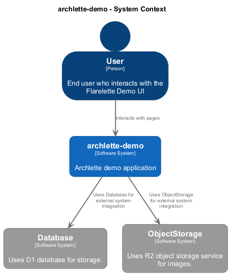

# 🏗️ archlette-demo

**Architecture Documentation**
Generated 2025-11-04 19:56:00

## Overview

Archlette demo application

---

## System Context

The system context diagram shows how archlette-demo fits into its environment, including external systems and users.

---

## Containers

The container diagram shows the high-level technology choices and how containers communicate.

<table>
<thead>
<tr>
<th>Container</th>
<th>Type</th>
<th>Description</th>
<th>Details</th>
</tr>
</thead>
<tbody>
<tr>
<td><strong>flarelette-demo-ui</strong></td>
<td><code>Cloudflare Worker</code></td>
<td>Cloudflare Worker: flarelette-demo-ui | Astro frontend for Flarelette demo</td>
<td><a href="./flarelette_demo_ui.md">View →</a></td>
</tr>
<tr>
<td><strong>content-service</strong></td>
<td><code>Cloudflare Worker</code></td>
<td>Cloudflare Worker: content-service | Content management service - news, events, pages (D1-backed)</td>
<td><a href="./content_service.md">View →</a></td>
</tr>
<tr>
<td><strong>forms-service</strong></td>
<td><code>Cloudflare Worker</code></td>
<td>Cloudflare Worker: forms-service | Form submission service (contact, tryouts, etc.)</td>
<td><a href="./forms_service.md">View →</a></td>
</tr>
<tr>
<td><strong>gateway</strong></td>
<td><code>Cloudflare Worker</code></td>
<td>Cloudflare Worker: gateway | Flarelette Gateway - EdDSA signing and routing</td>
<td><a href="./gateway.md">View →</a></td>
</tr>
<tr>
<td><strong>image-service</strong></td>
<td><code>Cloudflare Worker</code></td>
<td>Cloudflare Worker: image-service | Image management service with R2 storage</td>
<td><a href="./image_service.md">View →</a></td>
</tr>
</tbody>
</table>

---

Generated with <a href="https://github.com/chrislyons-dev/archlette">Archlette</a> Architecture-as-Code toolkit

