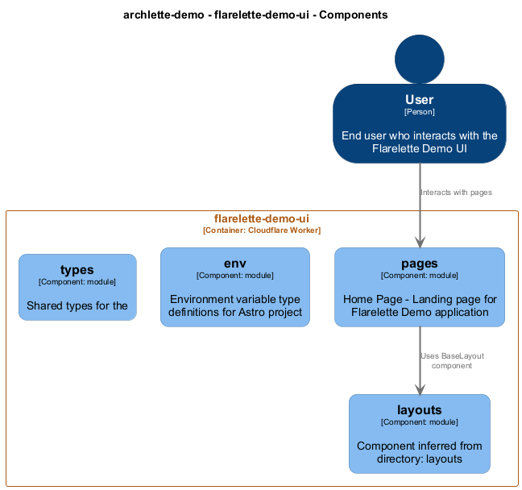

# flarelette-demo-ui

[← Back to System Overview](./README.md)

---

## Container Context

---

## Container Information

<table>
<tbody>
<tr>
<td><strong>Name</strong></td>
<td>flarelette-demo-ui</td>
</tr>
<tr>
<td><strong>Type</strong></td>
<td><code>Cloudflare Worker</code></td>
</tr>
<tr>
<td><strong>Description</strong></td>
<td>Cloudflare Worker: flarelette-demo-ui | Astro frontend for Flarelette demo</td>
</tr>
<tr>
<td><strong>Tags</strong></td>
<td><code>cloudflare</code>, <code>worker</code></td>
</tr>
</tbody>
</table>

---

## Components

### Component View

### Component Details

<table>
<thead>
<tr>
<th>Component</th>
<th>Type</th>
<th>Description</th>
<th>Code</th>
</tr>
</thead>
<tbody>
<tr>
<td><strong>layouts</strong></td>
<td><code>module</code></td>
<td>Component inferred from directory: layouts</td>
<td><a href="./flarelette_demo_ui__layouts.md">View →</a></td>
</tr>
<tr>
<td><strong>pages</strong></td>
<td><code>module</code></td>
<td>Home Page - Landing page for Flarelette Demo application</td>
<td><a href="./flarelette_demo_ui__pages.md">View →</a></td>
</tr>
<tr>
<td><strong>env</strong></td>
<td><code>module</code></td>
<td>Environment variable type definitions for Astro project</td>
<td><a href="./flarelette_demo_ui__env.md">View →</a></td>
</tr>
<tr>
<td><strong>types</strong></td>
<td><code>module</code></td>
<td>Shared types for the</td>
<td><a href="./flarelette_demo_ui__types.md">View →</a></td>
</tr>
</tbody>
</table>

---

<a href="./README.md">← Back to System Overview</a> | Generated with <a href="https://github.com/chrislyons-dev/archlette">Archlette</a>

