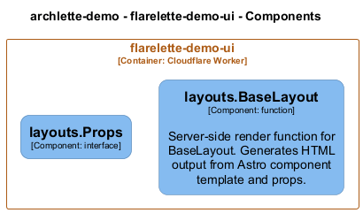

# layouts — Code View

[← Back to Container](./flarelette_demo_ui.md) | [← Back to System](./README.md)

---

## Component Information

<table>
<tbody>
<tr>
<td><strong>Component</strong></td>
<td>layouts</td>
</tr>
<tr>
<td><strong>Container</strong></td>
<td>flarelette-demo-ui</td>
</tr>
<tr>
<td><strong>Type</strong></td>
<td><code>module</code></td>
</tr>
<tr>
<td><strong>Description</strong></td>
<td>Component inferred from directory: layouts</td>
</tr>
</tbody>
</table>

---

## Code Structure

### Class Diagram

### Code Elements

<strong>2 code element(s)</strong>

#### Functions

##### `BaseLayout()`

Server-side render function for BaseLayout. Generates HTML output from Astro component template and props.

<table>
<tbody>
<tr>
<td><strong>Type</strong></td>
<td><code>function</code></td>
</tr>
<tr>
<td><strong>Visibility</strong></td>
<td><code>public</code></td>
</tr>
<tr>
<td><strong>Async</strong></td>
<td>Yes</td>
</tr>
<tr>
<td><strong>Returns</strong></td>
<td><code>Promise<string></code></td>
</tr>
<tr>
<td><strong>Location</strong></td>
<td><code>C:\Users\chris\git\flarelette-demo\ui\src\layouts\BaseLayout.astro:1</code></td>
</tr>
</tbody>
</table>

**Parameters:**

- `props`: <code>Props</code> — Component properties

---

---

<a href="./flarelette_demo_ui.md">← Back to Container</a> | <a href="./README.md">← Back to System</a> | Generated with <a href="https://github.com/chrislyons-dev/archlette">Archlette</a>

