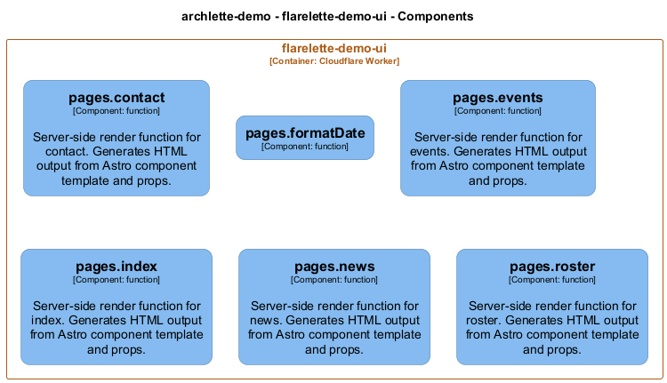

# pages — Code View

[← Back to Container](./flarelette_demo_ui.md) | [← Back to System](./README.md)

---

## Component Information

<table>
<tbody>
<tr>
<td><strong>Component</strong></td>
<td>pages</td>
</tr>
<tr>
<td><strong>Container</strong></td>
<td>flarelette-demo-ui</td>
</tr>
<tr>
<td><strong>Type</strong></td>
<td><code>module</code></td>
</tr>
<tr>
<td><strong>Description</strong></td>
<td>Home Page - Landing page for Flarelette Demo application</td>
</tr>
</tbody>
</table>

---

## Code Structure

### Class Diagram

### Code Elements

<strong>6 code element(s)</strong>

#### Functions

##### `contact()`

Server-side render function for contact. Generates HTML output from Astro component template and props.

<table>
<tbody>
<tr>
<td><strong>Type</strong></td>
<td><code>function</code></td>
</tr>
<tr>
<td><strong>Visibility</strong></td>
<td><code>public</code></td>
</tr>
<tr>
<td><strong>Async</strong></td>
<td>Yes</td>
</tr>
<tr>
<td><strong>Returns</strong></td>
<td><code>Promise<string></code></td>
</tr>
<tr>
<td><strong>Location</strong></td>
<td><code>C:\Users\chris\git\flarelette-demo\ui\src\pages\contact.astro:1</code></td>
</tr>
</tbody>
</table>

---

##### `formatDate()`

<table>
<tbody>
<tr>
<td><strong>Type</strong></td>
<td><code>function</code></td>
</tr>
<tr>
<td><strong>Visibility</strong></td>
<td><code>internal</code></td>
</tr>
<tr>
<td><strong>Returns</strong></td>
<td><code>string</code></td>
</tr>
<tr>
<td><strong>Location</strong></td>
<td><code>C:\Users\chris\git\flarelette-demo\ui\src\pages\events.astro:20</code></td>
</tr>
</tbody>
</table>

**Parameters:**

- `dateString`: <code>string</code>

---

##### `events()`

Server-side render function for events. Generates HTML output from Astro component template and props.

<table>
<tbody>
<tr>
<td><strong>Type</strong></td>
<td><code>function</code></td>
</tr>
<tr>
<td><strong>Visibility</strong></td>
<td><code>public</code></td>
</tr>
<tr>
<td><strong>Async</strong></td>
<td>Yes</td>
</tr>
<tr>
<td><strong>Returns</strong></td>
<td><code>Promise<string></code></td>
</tr>
<tr>
<td><strong>Location</strong></td>
<td><code>C:\Users\chris\git\flarelette-demo\ui\src\pages\events.astro:1</code></td>
</tr>
</tbody>
</table>

---

##### `index()`

Server-side render function for index. Generates HTML output from Astro component template and props.

<table>
<tbody>
<tr>
<td><strong>Type</strong></td>
<td><code>function</code></td>
</tr>
<tr>
<td><strong>Visibility</strong></td>
<td><code>public</code></td>
</tr>
<tr>
<td><strong>Async</strong></td>
<td>Yes</td>
</tr>
<tr>
<td><strong>Returns</strong></td>
<td><code>Promise<string></code></td>
</tr>
<tr>
<td><strong>Location</strong></td>
<td><code>C:\Users\chris\git\flarelette-demo\ui\src\pages\index.astro:1</code></td>
</tr>
</tbody>
</table>

---

##### `news()`

Server-side render function for news. Generates HTML output from Astro component template and props.

<table>
<tbody>
<tr>
<td><strong>Type</strong></td>
<td><code>function</code></td>
</tr>
<tr>
<td><strong>Visibility</strong></td>
<td><code>public</code></td>
</tr>
<tr>
<td><strong>Async</strong></td>
<td>Yes</td>
</tr>
<tr>
<td><strong>Returns</strong></td>
<td><code>Promise<string></code></td>
</tr>
<tr>
<td><strong>Location</strong></td>
<td><code>C:\Users\chris\git\flarelette-demo\ui\src\pages\news.astro:1</code></td>
</tr>
</tbody>
</table>

---

##### `roster()`

Server-side render function for roster. Generates HTML output from Astro component template and props.

<table>
<tbody>
<tr>
<td><strong>Type</strong></td>
<td><code>function</code></td>
</tr>
<tr>
<td><strong>Visibility</strong></td>
<td><code>public</code></td>
</tr>
<tr>
<td><strong>Async</strong></td>
<td>Yes</td>
</tr>
<tr>
<td><strong>Returns</strong></td>
<td><code>Promise<string></code></td>
</tr>
<tr>
<td><strong>Location</strong></td>
<td><code>C:\Users\chris\git\flarelette-demo\ui\src\pages\roster.astro:1</code></td>
</tr>
</tbody>
</table>

---

---

<a href="./flarelette_demo_ui.md">← Back to Container</a> | <a href="./README.md">← Back to System</a> | Generated with <a href="https://github.com/chrislyons-dev/archlette">Archlette</a>

