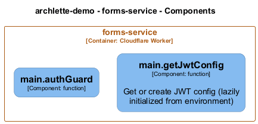

# main — Code View

[← Back to Container](./forms_service.md) | [← Back to System](./README.md)

---

## Component Information

<table>
<tbody>
<tr>
<td><strong>Component</strong></td>
<td>main</td>
</tr>
<tr>
<td><strong>Container</strong></td>
<td>forms-service</td>
</tr>
<tr>
<td><strong>Type</strong></td>
<td><code>module</code></td>
</tr>
<tr>
<td><strong>Description</strong></td>
<td>Forms Service

Handles form submissions (contact, tryouts, etc.)
All endpoints require internal JWT verification.</td>

</tr>
</tbody>
</table>

---

## Code Structure

### Class Diagram

### Code Elements

<strong>2 code element(s)</strong>

#### Functions

##### `getJwtConfig()`

Get or create JWT config (lazily initialized from environment)

<table>
<tbody>
<tr>
<td><strong>Type</strong></td>
<td><code>function</code></td>
</tr>
<tr>
<td><strong>Visibility</strong></td>
<td><code>private</code></td>
</tr>
<tr>
<td><strong>Returns</strong></td>
<td><code>any</code></td>
</tr>
<tr>
<td><strong>Location</strong></td>
<td><code>C:/Users/chris/git/flarelette-demo/workers/forms-service/src/index.ts:30</code></td>
</tr>
</tbody>
</table>

**Parameters:**

- `env`: <code>Env</code>

---

##### `authGuard()`

<table>
<tbody>
<tr>
<td><strong>Type</strong></td>
<td><code>function</code></td>
</tr>
<tr>
<td><strong>Visibility</strong></td>
<td><code>private</code></td>
</tr>
<tr>
<td><strong>Returns</strong></td>
<td><code>(c: Context<{ Bindings: Env; Variables: { auth: JwtPayload; }; }>, next: Next) => Promise<any></code></td>
</tr>
<tr>
<td><strong>Location</strong></td>
<td><code>C:/Users/chris/git/flarelette-demo/workers/forms-service/src/index.ts:46</code></td>
</tr>
</tbody>
</table>

**Parameters:**

- `policyObj`: <code>Policy</code>

---

---

<a href="./forms_service.md">← Back to Container</a> | <a href="./README.md">← Back to System</a> | Generated with <a href="https://github.com/chrislyons-dev/archlette">Archlette</a>

