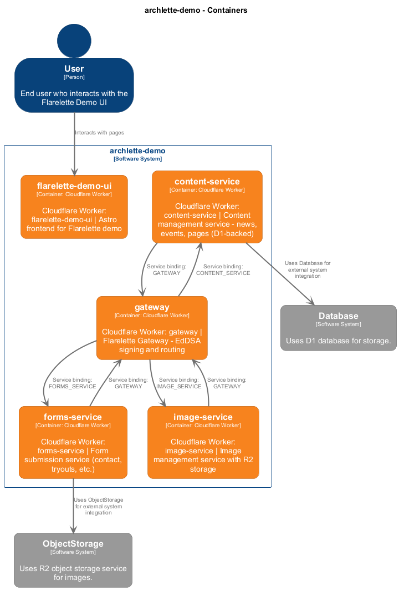
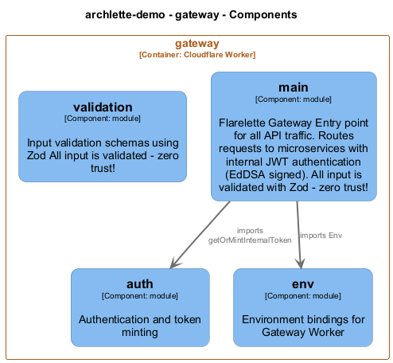

# gateway

[← Back to System Overview](./README.md)

---

## Container Context

---

## Container Information

<table>
<tbody>
<tr>
<td><strong>Name</strong></td>
<td>gateway</td>
</tr>
<tr>
<td><strong>Type</strong></td>
<td><code>Cloudflare Worker</code></td>
</tr>
<tr>
<td><strong>Description</strong></td>
<td>Cloudflare Worker: gateway | Flarelette Gateway - EdDSA signing and routing</td>
</tr>
<tr>
<td><strong>Tags</strong></td>
<td><code>cloudflare</code>, <code>worker</code></td>
</tr>
</tbody>
</table>

---

## Components

### Component View

### Component Details

<table>
<thead>
<tr>
<th>Component</th>
<th>Type</th>
<th>Description</th>
<th>Code</th>
</tr>
</thead>
<tbody>
<tr>
<td><strong>auth</strong></td>
<td><code>module</code></td>
<td>Authentication and token minting</td>
<td><a href="./gateway__auth.md">View →</a></td>
</tr>
<tr>
<td><strong>env</strong></td>
<td><code>module</code></td>
<td>Environment bindings for Gateway Worker</td>
<td><a href="./gateway__env.md">View →</a></td>
</tr>
<tr>
<td><strong>main</strong></td>
<td><code>module</code></td>
<td>Flarelette Gateway

Entry point for all API traffic. Routes requests to microservices
with internal JWT authentication (EdDSA signed).

All input is validated with Zod - zero trust!</td>

<td><a href="./gateway__main.md">View →</a></td>
</tr>
<tr>
<td><strong>validation</strong></td>
<td><code>module</code></td>
<td>Input validation schemas using Zod
All input is validated - zero trust!</td>
<td><a href="./gateway__validation.md">View →</a></td>
</tr>
</tbody>
</table>

---

<a href="./README.md">← Back to System Overview</a> | Generated with <a href="https://github.com/chrislyons-dev/archlette">Archlette</a>

