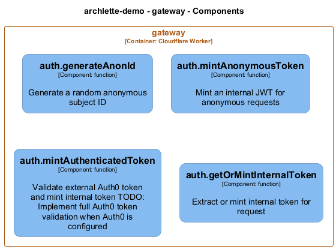

# auth — Code View

[← Back to Container](./gateway.md) | [← Back to System](./README.md)

---

## Component Information

<table>
<tbody>
<tr>
<td><strong>Component</strong></td>
<td>auth</td>
</tr>
<tr>
<td><strong>Container</strong></td>
<td>gateway</td>
</tr>
<tr>
<td><strong>Type</strong></td>
<td><code>module</code></td>
</tr>
<tr>
<td><strong>Description</strong></td>
<td>Authentication and token minting</td>
</tr>
</tbody>
</table>

---

## Code Structure

### Class Diagram

### Code Elements

<strong>4 code element(s)</strong>

#### Functions

##### `generateAnonId()`

Generate a random anonymous subject ID

<table>
<tbody>
<tr>
<td><strong>Type</strong></td>
<td><code>function</code></td>
</tr>
<tr>
<td><strong>Visibility</strong></td>
<td><code>private</code></td>
</tr>
<tr>
<td><strong>Returns</strong></td>
<td><code>string</code></td>
</tr>
<tr>
<td><strong>Location</strong></td>
<td><code>C:/Users/chris/git/flarelette-demo/workers/gateway/src/auth.ts:12</code></td>
</tr>
</tbody>
</table>

---

##### `mintAnonymousToken()`

Mint an internal JWT for anonymous requests

<table>
<tbody>
<tr>
<td><strong>Type</strong></td>
<td><code>function</code></td>
</tr>
<tr>
<td><strong>Visibility</strong></td>
<td><code>public</code></td>
</tr>
<tr>
<td><strong>Async</strong></td>
<td>Yes</td>
</tr>
<tr>
<td><strong>Returns</strong></td>
<td><code>Promise<string></code></td>
</tr>
<tr>
<td><strong>Location</strong></td>
<td><code>C:/Users/chris/git/flarelette-demo/workers/gateway/src/auth.ts:21</code></td>
</tr>
</tbody>
</table>

**Parameters:**

- `env`: <code>import("C:/Users/chris/git/flarelette-demo/workers/gateway/src/env").Env</code>

---

##### `mintAuthenticatedToken()`

Validate external Auth0 token and mint internal token
TODO: Implement full Auth0 token validation when Auth0 is configured

<table>
<tbody>
<tr>
<td><strong>Type</strong></td>
<td><code>function</code></td>
</tr>
<tr>
<td><strong>Visibility</strong></td>
<td><code>public</code></td>
</tr>
<tr>
<td><strong>Async</strong></td>
<td>Yes</td>
</tr>
<tr>
<td><strong>Returns</strong></td>
<td><code>Promise<string></code></td>
</tr>
<tr>
<td><strong>Location</strong></td>
<td><code>C:/Users/chris/git/flarelette-demo/workers/gateway/src/auth.ts:39</code></td>
</tr>
</tbody>
</table>

**Parameters:**

- `authHeader`: <code>string</code>

---

##### `getOrMintInternalToken()`

Extract or mint internal token for request

<table>
<tbody>
<tr>
<td><strong>Type</strong></td>
<td><code>function</code></td>
</tr>
<tr>
<td><strong>Visibility</strong></td>
<td><code>public</code></td>
</tr>
<tr>
<td><strong>Async</strong></td>
<td>Yes</td>
</tr>
<tr>
<td><strong>Returns</strong></td>
<td><code>Promise<string></code></td>
</tr>
<tr>
<td><strong>Location</strong></td>
<td><code>C:/Users/chris/git/flarelette-demo/workers/gateway/src/auth.ts:62</code></td>
</tr>
</tbody>
</table>

**Parameters:**

- `request`: <code>Request</code>- `env`: <code>import("C:/Users/chris/git/flarelette-demo/workers/gateway/src/env").Env</code>

---

---

<a href="./gateway.md">← Back to Container</a> | <a href="./README.md">← Back to System</a> | Generated with <a href="https://github.com/chrislyons-dev/archlette">Archlette</a>

