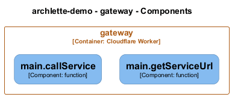

# main — Code View

[← Back to Container](./gateway.md) | [← Back to System](./README.md)

---

## Component Information

<table>
<tbody>
<tr>
<td><strong>Component</strong></td>
<td>main</td>
</tr>
<tr>
<td><strong>Container</strong></td>
<td>gateway</td>
</tr>
<tr>
<td><strong>Type</strong></td>
<td><code>module</code></td>
</tr>
<tr>
<td><strong>Description</strong></td>
<td>Flarelette Gateway

Entry point for all API traffic. Routes requests to microservices
with internal JWT authentication (EdDSA signed).

All input is validated with Zod - zero trust!</td>

</tr>
</tbody>
</table>

---

## Code Structure

### Class Diagram

### Code Elements

<strong>2 code element(s)</strong>

#### Functions

##### `getServiceUrl()`

<table>
<tbody>
<tr>
<td><strong>Type</strong></td>
<td><code>function</code></td>
</tr>
<tr>
<td><strong>Visibility</strong></td>
<td><code>private</code></td>
</tr>
<tr>
<td><strong>Returns</strong></td>
<td><code>string</code></td>
</tr>
<tr>
<td><strong>Location</strong></td>
<td><code>C:/Users/chris/git/flarelette-demo/workers/gateway/src/index.ts:26</code></td>
</tr>
</tbody>
</table>

**Parameters:**

- `env`: <code>import("C:/Users/chris/git/flarelette-demo/workers/gateway/src/env").Env</code>- `serviceName`: <code>"content" | "forms" | "image"</code>

---

##### `callService()`

<table>
<tbody>
<tr>
<td><strong>Type</strong></td>
<td><code>function</code></td>
</tr>
<tr>
<td><strong>Visibility</strong></td>
<td><code>private</code></td>
</tr>
<tr>
<td><strong>Async</strong></td>
<td>Yes</td>
</tr>
<tr>
<td><strong>Returns</strong></td>
<td><code>Promise<Response></code></td>
</tr>
<tr>
<td><strong>Location</strong></td>
<td><code>C:/Users/chris/git/flarelette-demo/workers/gateway/src/index.ts:45</code></td>
</tr>
</tbody>
</table>

**Parameters:**

- `env`: <code>import("C:/Users/chris/git/flarelette-demo/workers/gateway/src/env").Env</code>- `serviceName`: <code>"content" | "forms" | "image"</code>- `path`: <code>string</code>- `init`: <code>RequestInit</code>

---

---

<a href="./gateway.md">← Back to Container</a> | <a href="./README.md">← Back to System</a> | Generated with <a href="https://github.com/chrislyons-dev/archlette">Archlette</a>

