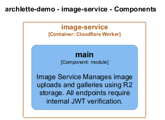

# image-service

[← Back to System Overview](./README.md)

---

## Container Context

---

## Container Information

<table>
<tbody>
<tr>
<td><strong>Name</strong></td>
<td>image-service</td>
</tr>
<tr>
<td><strong>Type</strong></td>
<td><code>Cloudflare Worker</code></td>
</tr>
<tr>
<td><strong>Description</strong></td>
<td>Cloudflare Worker: image-service | Image management service with R2 storage</td>
</tr>
<tr>
<td><strong>Tags</strong></td>
<td><code>cloudflare</code>, <code>worker</code></td>
</tr>
</tbody>
</table>

---

## Components

### Component View

### Component Details

<table>
<thead>
<tr>
<th>Component</th>
<th>Type</th>
<th>Description</th>
<th>Code</th>
</tr>
</thead>
<tbody>
<tr>
<td><strong>main</strong></td>
<td><code>module</code></td>
<td>Image Service

Manages image uploads and galleries using R2 storage.
All endpoints require internal JWT verification.</td>

<td><a href="./image_service__main.md">View →</a></td>
</tr>
</tbody>
</table>

---

<a href="./README.md">← Back to System Overview</a> | Generated with <a href="https://github.com/chrislyons-dev/archlette">Archlette</a>

